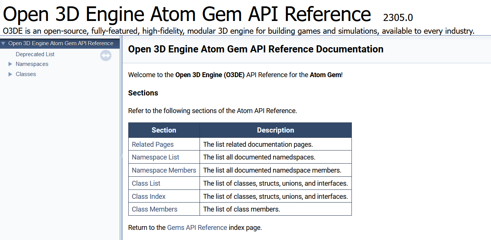
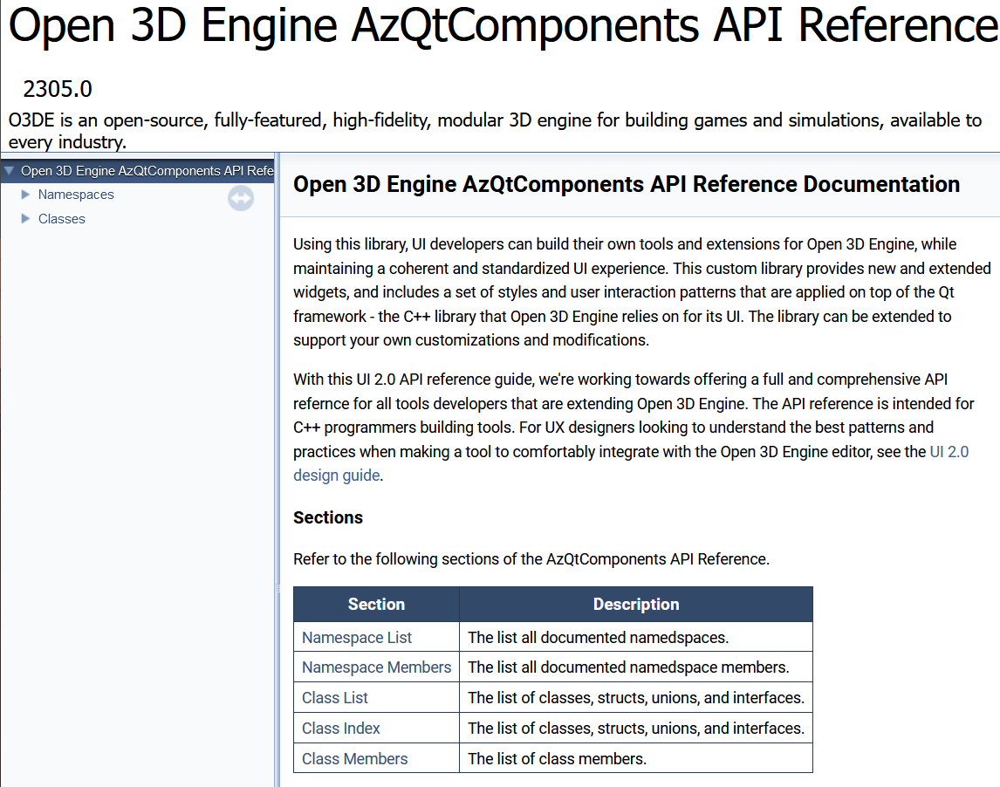

# C++ API Reference Generation

The [Open 3D Engine (O3DE) API Reference](https://www.o3de.org/docs/api/) is generated using [Doxygen](https://www.doxygen.nl/). With the help of the API Reference Generation (`o3de-doxygen`) scripts to automate the process, an API reference is generated for all frameworks and Gems in the [`o3de` repository](https://github.com/o3de/o3de) by default.  You may also configure the scripts to [generate API references for Gems in other O3DE repositories](#generating-for-gems-outside-of-o3de).


## Requirements

* Linux machine or Windows Subsystem for Linux (WSL)
* Clone of the `o3de` repository in your machine
* Clone of the `o3de.org` repository in your machine
* [Doxygen](https://www.doxygen.nl/manual/install.html) installation

## Set up 

### Download `o3de-doxygen`

1. Clone the  [`sig-docs-community` repository](https://github.com/o3de/sig-docs-community/), which contains the `o3de-doxygen` scripts.
2. In the `tools` directory, find the `o3de-doxygen` scripts.


### Install rust commands

The `o3de-doxygen` scripts use some efficient Rust commands for processing the source code in `o3de`. You must install Rust and the `fd-find` cargo to run the scripts properly. 


1. Install Rust by using [rustup](https://rustup.rs/), or by running the following command in your Linux machine: 

    ```shell
    curl --proto '=https' --tlsv1.2 -sSf https://sh.rustup.rs | sh
    ```

1. Add rust to your environment variables.

    ```shell
    source "$HOME/.cargo/env"
    ```

1. Install the `fd-find` cargo, which is a file searching tool:

    ```shell
    cargo install fd-find
    ```


### Clean repos

The C++ API reference generation scripts run Doxygen on your local `o3de` clone. Then it outputs the generated files into your local `o3de.org` clone. Therefore, before you generate the API, you must ensure that your cloned repos are clean and have the latest changes.

#### `o3de`

1. In your local `o3de` clone, `git checkout` the latest updates in the `development` branch, or in the case of a major O3DE release, the `stabilization` branch. 

    ```shell
    git fetch --all
    git checkout upstream/<branch> 
    ```
   -  **upstream**: Set to track the source repo, [`https://github.com/o3de/o3de.git`](https://github.com/o3de/o3de.git)

1. Make sure the branch is clean from any untracked files or changes. The branch should be at the same state as the upstream branch's HEAD. To clean, run  `git clean`, `git reset`, or `git stash` as needed.

#### `o3de.org`

1. In your local `o3de.org` clone, `git checkout` the latest updates in the `development` branch, or in the case of a major O3DE release, the `stabilization` branch. 

    ```shell
    git fetch --all
    git checkout upstream/<branch> 
    ```
   -  **upstream**: Set to track the source repo, [`https://github.com/o3de/o3de.org.git`](https://github.com/o3de/o3de.org.git)

1. Create a new branch, such as `api-ref`. This branch will contain the API reference docs that you will [generate](#generate) in a later step.

    ```shell
    git switch -c api-ref
    ```

1. Make sure the branch is clean from any untracked files or changes. The branch should be at the same state as the upstream branch's HEAD. To clean, run  `git clean`, `git reset`, or `git stash` as needed.

### Prepare scripts

1. Edit `config.sh` in the `o3de-doxygen` directory and set the following variables:

   - `O3DE_PATH`: Path to your local o3de clone  (e.g. `O3DE_PATH=$HOME/o3de`)

   - `O3DEORG_PATH`: Path to your local o3de.org clone (e.g. `O3DEORG_PATH=$HOME/o3de.org`)
   
   - `PROJECT_NUMBER`: The O3DE version that of this API reference  (e.g. `PROJECT_NUMBER=23.05.0`)

    The C++ API reference generation scripts read from `O3DE_PATH` and write to `O3DEORG_PATH`. 

1. If this is your first time running the script, you may need to enable permissions to execute the program. In the `o3de-doxygen` directory, run the following: 

```shell
cd <path-to>/o3de-doxygen
chmod +x *.sh
```

## Generate

The following scripts generate the frameworks and Gems APIs. 

### Frameworks API

In the `o3de-doxygen` directory, run the script:

```shell
./o3de-framework-apis.sh
```

This generates the following files in `O3DEORG_PATH`: 
 - `content/docs/api/frameworks/_index.md`
 - `static/docs/api/frameworks/*`

### Gems API

*Note: You must [install rust commands](#install-rust-commands) to run `o3de-gem-apis.sh`.*

In the `o3de-doxygen` directory, run the script:

```shell
./o3de-gem-apis.sh
```

This generates the following files in `O3DEORG_PATH`: 
  - `content/docs/api/gems/_index.md`
  - `static/docs/api/gems/*`


## Publish

After generating the C++ API reference and supplemental files, it's time to publish them on the website. When you [cleaned your `o3de.org` clone](#o3deorg), you set up a new clean branch, such as `api-ref`, and when you [generated](#generate) the APIs, the files were placed in that branch. 

To publish the newly generated APIs, you must run `git add`, `git commit`, `git push`, and create a new pull request. For guidance through each step, please refer to the [O3DE Docs Contributions: Runbook](https://www.o3de.org/docs/contributing/to-docs/git-workflow/).


## Generating for Gems outside of `o3de`

In some cases, the O3DE API Reference must include the API for code that lives outside of the `o3de` repository. This is typically decided by O3DE members and the Release Special Interest Group (SIG). For example, a major O3DE release may include new Gems that live in the `o3de-extras` repository.

To generate API References for Gems outside of `o3de`: 

1. Move or copy the Gem's directory into the `Gems` directory of your local `o3de` clone. 

    To do this using the terminal in your Linux machine, run the following `cp` command with your specified paths. This copies the Gem into the `o3de/Gems/` directory.

    ```shell
    cp -r <path-to-gem> <path-to>/o3de/Gems
    ```

2. [Generate the Gems API](#gems-api). 


## Customizing the API's main page

The main page is the first page you see when you open a framework or Gem's Doxygen-generated API reference. For example, open any [framework](https://www.o3de.org/docs/api/frameworks/) or [Gem](https://www.o3de.org/docs/api/gems/) in the API docs. The contents of the main page is either automatically generated, or specified by the developer by using the Doxygen command, [\mainpage](https://doxygen.nl/manual/commands.html#cmdmainpage), in the code's comments.

By default, if `\mainpage` is not specified, an API's main page includes a brief introduction and a table of contents, like the following: 



If a developer documents the API using `/mainpage`, it will replace the default introduction. However, you may still insert the table of contents by adding `o3de-doxygen-insert-table` to your `/mainpage` comment block. For example, this comment block in the AzQtComponents's source code generates the following main page. 

```
/**
 * \mainpage
 * 
 * Using this library, UI developers can build their own tools and
 * extensions for Open 3D Engine, while maintaining a coherent and standardized UI experience.
 * This custom library provides new and extended widgets, and includes a set of styles and
 * user interaction patterns that are applied on top of the Qt framework - the C++ library
 * that Open 3D Engine relies on for its UI. The library can be extended to support your own customizations and modifications. 
 * 
 * With this UI 2.0 API reference guide, we're working towards offering a full and comprehensive
 * API reference for all tools developers that are extending Open 3D Engine. The API reference
 * is intended for C++ programmers building tools. For UX designers looking to understand
 * the best patterns and practices when making a tool to comfortably integrate with
 * the Open 3D Engine editor, see the [UI 2.0 design guide](https://o3de.org/docs/tools-ui/ui-dev-intro/).
 * 
 * o3de-doxygen-insert-table
 * 
 */
```

